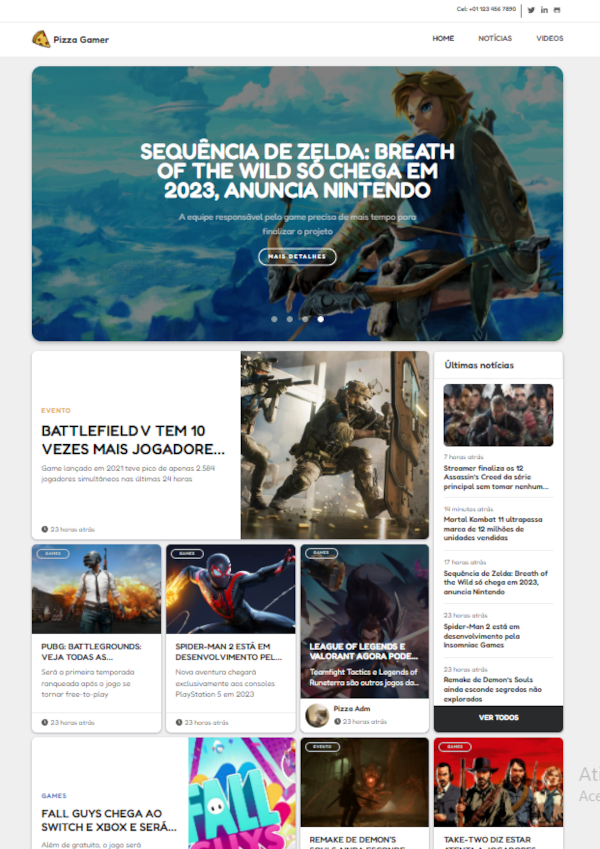

<a style="color: #fff; display: flex; align-items: center; justify-content: center; font-weight: bold; font-size: 26px; text-decoration: none;" href="http://pizzagamer.marlonweb.com/" target="_blank">Pizza Gamer</a>

#### Link do site do projeto: https://pizzagamer.marlonweb.com
#### Link para CMS do projeto: http://pizzagamer.marlonweb.com/admin

## Sobre o projeto

Projeto é um portal de notícia sobre na área de games

- Sistema de CMS para gerênciar o site
- Filtragem pesquisar artigos e video
- Autenticação e autorização

Stacks usados

- Laravel, LaravelMix
- Sass
- JQuery
- HTML, CSS
- NPM
- Tinymce, chart, fontawesome

## Instalação
`git clone https://github.com/marlinho20/pizzagamer.git`

`composer install`

Se não existir '.env' faz seguinte comando

`copy .env.example .env`

Criar banco de dados e configurar banco no '.env'

`php artisan migrate:fresh --seed`